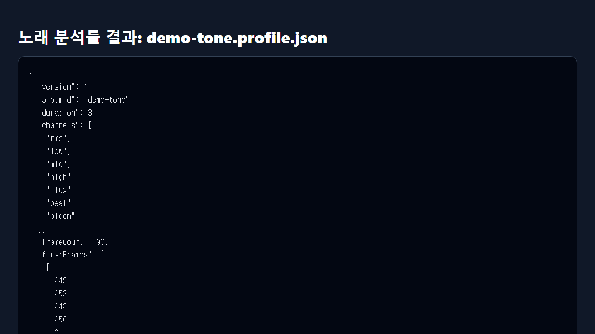

# mp32json

[English](../README.md) | [한국어](README.ko.md) | [日本語](README.ja.md) | [中文](README.zh-CN.md)

`ffmpeg` で音声を Web ビジュアライザー／音声連動 UI 向け compact JSON に変換する、JavaScript 依存関係のない Node.js CLI です。

## 機能と制限

単一ファイルまたはフォルダーを再帰的に一括解析し、AAC、AIFF、FLAC、M4A、MP3、OGG、Opus、WAV、WebM（`ffmpeg` が decode 可能なもの）に対応します。`rms`、`low`、`mid`、`high`、`flux`、`beat`、`bloom` を 0～255 で compact／readable JSON に出力します。

単純な one-pole filter、曲ごとの正規化、heuristic な beat 検出を使うため、音楽情報検索や mastering のツールではなく、beat は概算です。

## 要件と実行

Node.js 20 以上と PATH 上の `ffmpeg` が必要です。package は `private` で npm 公開版や実行ファイル release はありません。JS 依存関係がないため `npm install` は不要です。

```bash
node src/analyze-audio.js --help
node src/analyze-audio.js "song.mp3" --album-id my-song --output result/my-song.profile.json
npm run batch
```

batch は既定で `source/` を再帰走査し `result/` へ書きます。`--fps`（既定30）、`--format compact|readable`、`--output`、`--source-dir`、`--result-dir` を指定できます。単一ファイルで出力先を省略すると stdout へ出ます。binary `.u8` は未実装です。同じ slug のファイルは上書きされるため、固有の基本名を使ってください。

## 出力の利用

`frames` は 0～255 の整数です。`Math.floor(currentTime * profile.fps)` で frame を選び、各値を 255 で割って 0～1 として使います。出力項目は `version`、`albumId`、`fps`、`duration`、`channels`、`frames`、`beats` です。

## プライバシー・著作権・資源制限

処理はローカルで、音声を upload しません。`source/` と `result/` の実ファイルは gitignore 対象ですが管理責任は利用者にあります。所有または処理許可のある音声だけを使い、原音を無断 commit／配布しないでください。生成データによって原音の著作権・license 制限は消えません。decode 音声と frame を memory に保持し、ffmpeg buffer は 512 MiB 上限のため長い音声は多くの memory を使います。

## 状態と検証

初期版 `0.1.0` で自動テスト一式はありません。`--help` の後、利用許可のある小さな音声で実解析を確認してください。



## ライセンスと出典表記のお願い

個別 license はありません。公開ソースだけを理由に複製・変更・再配布の権利を仮定せず、必要な権利を確認してください。紹介または許可された派生利用では `@Bum-Boo` と [元のリポジトリ](https://github.com/Bum-Boo/mp32json)を記載していただけると幸いです。これは任意のお願いで、license 義務を追加・代替しません。
